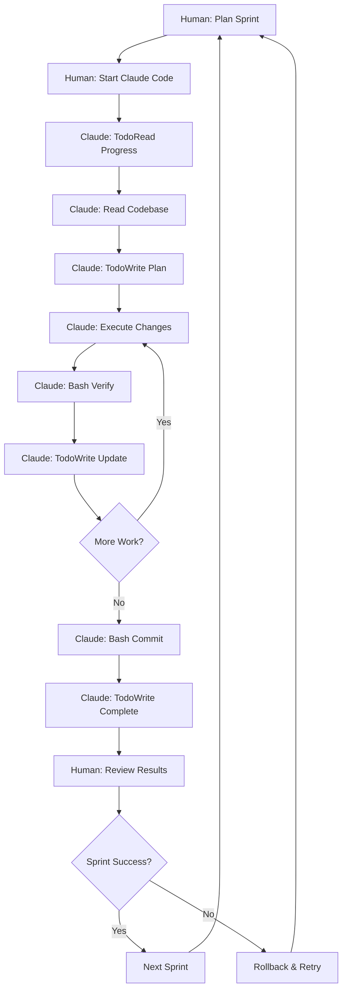

# FRC Scouting App Refactoring Documentation

## 📋 Documentation Index

This directory contains comprehensive documentation for the AI-assisted refactoring of the FRC GPT Scouting App. All documents are designed to work together to ensure safe, successful refactoring.

### Core Planning Documents
- **[MASTER_REFACTORING_GUIDE.md](MASTER_REFACTORING_GUIDE.md)** - ⭐ ACTIVE - The authoritative refactoring guide (USE THIS)
- **[USER_EXECUTION_GUIDE.md](USER_EXECUTION_GUIDE.md)** - Simple step-by-step instructions for users
- **[VISUAL_PRESERVATION_GUIDE.md](VISUAL_PRESERVATION_GUIDE.md)** - Critical requirements for interface preservation

### Context Window Management (CRITICAL)
- **[CONTEXT_WINDOW_PROTOCOL.md](CONTEXT_WINDOW_PROTOCOL.md)** - ⭐ CRITICAL - Baseline reference and intent communication
- **[SESSION_INTENT_TEMPLATE.md](SESSION_INTENT_TEMPLATE.md)** - Template for preserving intent between sessions
- **[AI_PROMPT_GUIDE.md](AI_PROMPT_GUIDE.md)** - Templates and best practices for AI interaction
- **[SPRINT_EXECUTION_CHECKLIST.md](SPRINT_EXECUTION_CHECKLIST.md)** - Step-by-step sprint execution guide

### Safety and Recovery
- **[BASELINE_CREATION_GUIDE.md](BASELINE_CREATION_GUIDE.md)** - Creating and maintaining immutable baseline
- **[CONTEXT_PRESERVATION_GUIDE.md](CONTEXT_PRESERVATION_GUIDE.md)** - Maintaining AI context across sessions
- **[ROLLBACK_PROCEDURES.md](ROLLBACK_PROCEDURES.md)** - Emergency recovery procedures

### Quality Assurance
- **[TESTING_STANDARDS.md](TESTING_STANDARDS.md)** - Comprehensive testing guidelines
- **[SUCCESS_METRICS_TRACKING.md](SUCCESS_METRICS_TRACKING.md)** - Progress tracking and success measurement

## 🚀 Quick Start Guide

### For Users (Non-Technical)
1. Read [USER_EXECUTION_GUIDE.md](USER_EXECUTION_GUIDE.md) - This is all you need!
2. Follow the simple step-by-step instructions
3. Paste prompts when instructed
4. Test the application and report issues

### For Project Leads
1. Review [MASTER_REFACTORING_GUIDE.md](MASTER_REFACTORING_GUIDE.md) for the approach
2. Ensure user understands their limited role (prompts, testing, error reporting only)
3. Set up baseline using [BASELINE_CREATION_GUIDE.md](BASELINE_CREATION_GUIDE.md)
4. Begin Sprint 1 using user guide prompts

### For Developers
1. Study [AI_PROMPT_GUIDE.md](AI_PROMPT_GUIDE.md) for AI interaction patterns
2. Understand [CONTEXT_PRESERVATION_GUIDE.md](CONTEXT_PRESERVATION_GUIDE.md) for session continuity
3. Follow [TESTING_STANDARDS.md](TESTING_STANDARDS.md) for all code changes
4. Know [ROLLBACK_PROCEDURES.md](ROLLBACK_PROCEDURES.md) for emergency situations

### For Claude Code Sessions
1. Use TodoRead to check progress at session start
2. Follow systematic tool usage: Read → Edit → Bash → TodoWrite
3. Use templates from [CLAUDE_CODE_SPRINT_TEMPLATE.md](CLAUDE_CODE_SPRINT_TEMPLATE.md)
4. Verify changes with Bash tools and update progress with TodoWrite

## 📁 Directory Structure

```
Refactor Documents/
├── README.md                        # This file
├── MASTER_REFACTORING_GUIDE.md     # ⭐ ACTIVE - Main guide (USE THIS)
├── USER_EXECUTION_GUIDE.md         # Simple user instructions
├── VISUAL_PRESERVATION_GUIDE.md    # Visual preservation requirements
├── CONTEXT_WINDOW_PROTOCOL.md     # ⭐ CRITICAL - Baseline reference & intent
├── SESSION_INTENT_TEMPLATE.md     # Intent preservation between sessions
├── CLAUDE_CODE_SPRINT_TEMPLATE.md  # Claude Code sprint template
├── AI_PROMPT_GUIDE.md              # Claude Code specific prompts  
├── SPRINT_EXECUTION_CHECKLIST.md   # Sprint procedures
├── BASELINE_CREATION_GUIDE.md      # Baseline management
├── CONTEXT_PRESERVATION_GUIDE.md   # Context continuity
├── TESTING_STANDARDS.md            # Test guidelines
├── ROLLBACK_PROCEDURES.md          # Emergency procedures
├── SUCCESS_METRICS_TRACKING.md     # Progress tracking
├── KICKOFF_CHECKLIST.md            # Pre-refactoring readiness
├── CLAUDE_CODE_OPTIMIZATION_SUMMARY.md # Claude Code optimizations
├── archived_plans/                 # ⚠️ DEPRECATED - Do not use
│   ├── AI_REFACTORING_PLAN.md      # Old 10-sprint plan
│   ├── IMPROVED_REFACTORING_PLAN.md # Old 30-sprint plan
│   └── REVISED_REFACTORING_PLAN.md # Consolidated into MASTER guide
└── scripts/                        # Supporting scripts (WSL-compatible)
    ├── setup_refactoring.sh        # Initial setup
    ├── emergency_rollback.sh       # Emergency procedures
    ├── collect_metrics.py          # Metrics collection
    └── generate_dashboard.py       # Progress dashboard
```

## 🔄 Claude Code Workflow Overview



## 📋 Pre-Refactoring Checklist

Before starting the refactoring process:

### Environment Setup
- [ ] Development environment configured
- [ ] All dependencies installed
- [ ] API keys and credentials set up
- [ ] Docker environment working
- [ ] Git configuration verified

### Baseline Preparation
- [ ] Current system fully functional
- [ ] All existing functionality documented
- [ ] Performance baseline captured
- [ ] Baseline branch created and protected
- [ ] Initial metrics collected

### Team Preparation
- [ ] Team trained on procedures
- [ ] Roles and responsibilities assigned
- [ ] Communication plan established
- [ ] Escalation procedures defined
- [ ] Rollback authority designated

### Documentation Review
- [ ] All refactoring documents read
- [ ] Templates understood
- [ ] Metrics targets agreed upon
- [ ] Success criteria defined
- [ ] Risk mitigation plans approved

## 🎯 Success Criteria

The refactoring is considered successful when:

### Must-Have (Project Fails if Not Met)
- [ ] All existing functionality preserved
- [ ] No performance degradation
- [ ] Successful deployment at both test events
- [ ] Test coverage >60%
- [ ] Zero data loss or corruption

### Should-Have (Significant Value)
- [ ] Test coverage >80%
- [ ] Services <300 lines each
- [ ] Clear architecture boundaries
- [ ] Comprehensive documentation
- [ ] Improved maintainability

### Nice-to-Have (Bonus Points)
- [ ] Performance improvements
- [ ] Additional features enabled
- [ ] Team skills enhanced
- [ ] Automated deployment pipeline

## ⚠️ Risk Management

### High-Risk Areas
1. **Data Migration**: Any changes to data structures
2. **API Changes**: Modifications to public interfaces
3. **External Integrations**: TBA, Statbotics, Google Sheets
4. **Performance-Critical Paths**: Picklist generation, validation

### Mitigation Strategies
- Comprehensive testing before changes
- Parallel system operation during events
- Automated rollback procedures
- Regular checkpoint creation
- Continuous metric monitoring

## 🔧 Supporting Tools

### Automated Scripts
All scripts are located in the `scripts/` directory:

- **setup_refactoring.sh**: Initial environment setup
- **collect_metrics.py**: Automated metrics collection
- **verify_context.py**: Context verification between sessions
- **generate_dashboard.py**: Progress visualization
- **rollback_sprint.sh**: Emergency sprint rollback

### Manual Tools
- Checksum verification procedures
- Context snapshot creation
- Performance baseline comparison
- Test result analysis

## 📞 Support and Escalation

### Contact Information
- **Technical Lead**: [NAME] - Technical decisions and code review
- **Project Owner**: [NAME] - Requirements and acceptance
- **DevOps Lead**: [NAME] - Infrastructure and deployment
- **Team Lead**: [NAME] - Resource allocation and timeline

### Escalation Matrix
1. **Sprint Issues** → Technical Lead
2. **Timeline Concerns** → Project Owner
3. **Infrastructure Problems** → DevOps Lead
4. **Resource Conflicts** → Team Lead

## 📈 Progress Tracking

### Daily Activities
- Sprint execution checklist completion
- Metrics collection and analysis
- Context preservation verification
- Test result monitoring

### Weekly Reviews
- Sprint scorecard assessment
- Risk register updates
- Timeline and milestone review
- Team feedback collection

### Milestone Gates
- Baseline validation
- Sprint completion approval
- Event readiness assessment
- Final acceptance criteria

## 🎓 Learning and Improvement

### Knowledge Capture
- Document all decisions and rationale
- Record lessons learned after each sprint
- Maintain architectural decision records
- Update procedures based on experience

### Process Improvement
- Regular retrospectives
- Procedure refinement
- Tool optimization
- Template updates

## 📚 Additional Resources

### External Documentation
- [FastAPI Documentation](https://fastapi.tiangolo.com/)
- [React Testing Best Practices](https://testing-library.com/docs/react-testing-library/intro/)
- [Python Testing with Pytest](https://docs.pytest.org/)
- [Refactoring Patterns](https://refactoring.guru/refactoring)

### Project-Specific Resources
- Original system documentation in `/docs/`
- Architecture diagrams in `/ARCHITECTURE.md`
- Change log in `/CHANGELOG.md`
- Style guide in `/STYLE_GUIDE.md`

---

## 🚨 Emergency Procedures

If critical issues arise:

1. **STOP** all refactoring immediately
2. Run emergency rollback: `./scripts/emergency_rollback.sh`
3. Contact Technical Lead
4. Document the issue
5. Plan recovery approach

**Remember**: The baseline branch is your lifeline. When in doubt, return to baseline and reassess.

---

*This documentation package was created by the AI-Refactor Architect to ensure safe, successful refactoring of the FRC GPT Scouting App. All procedures have been designed to prevent the failures of previous refactoring attempts while enabling comprehensive system improvement.*